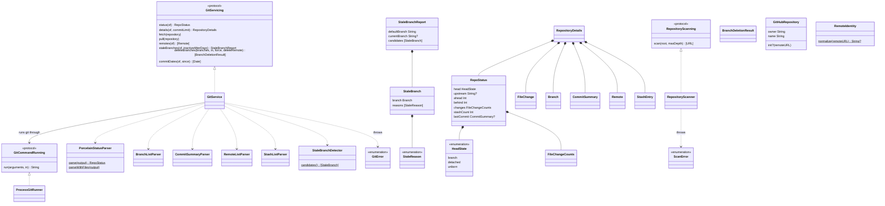

# RepoHubCore

The shared package: everything that reads git. It builds on macOS and Linux.

```mermaid
classDiagram
    class GitServicing {
        <<protocol>>
        status(of) RepoStatus
        details(of, commitLimit) RepositoryDetails
        fetch(repository)
        pull(repository)
        remotes(of) [Remote]
        staleBranches(of, inactiveAfterDays) StaleBranchReport
        deleteBranches(branches, in, force, deleteRemote) [BranchDeletionResult]
        commitDates(of, since) [Date]
    }
    class GitService
    class GitCommandRunning {
        <<protocol>>
        run(arguments, in) String
    }
    class ProcessGitRunner
    class RepositoryScanning {
        <<protocol>>
        scan(root, maxDepth) [URL]
    }
    class RepositoryScanner
    class PorcelainStatusParser {
        parse(output)$ RepoStatus
        parseWithFiles(output)$
    }
    class BranchListParser
    class CommitSummaryParser
    class RemoteListParser
    class StashListParser
    class StaleBranchDetector {
        candidates()$ [StaleBranch]
    }
    class RepoStatus {
        head HeadState
        upstream String?
        ahead Int
        behind Int
        changes FileChangeCounts
        stashCount Int
        lastCommit CommitSummary?
    }
    class RepositoryDetails
    class HeadState {
        <<enumeration>>
        branch
        detached
        unborn
    }
    class FileChangeCounts
    class FileChange
    class CommitSummary
    class Branch
    class Remote
    class StashEntry
    class StaleBranchReport {
        defaultBranch String
        currentBranch String?
        candidates [StaleBranch]
    }
    class StaleBranch {
        branch Branch
        reasons [StaleReason]
    }
    class StaleReason {
        <<enumeration>>
    }
    class BranchDeletionResult
    class GitHubRepository {
        owner String
        name String
        init?(remoteURL)
    }
    class RemoteIdentity {
        normalize(remoteURL)$ String?
    }
    class GitError {
        <<enumeration>>
    }
    class ScanError {
        <<enumeration>>
    }

    GitServicing <|.. GitService
    GitCommandRunning <|.. ProcessGitRunner
    RepositoryScanning <|.. RepositoryScanner
    GitService --> GitCommandRunning : runs git through
    GitService ..> PorcelainStatusParser
    GitService ..> BranchListParser
    GitService ..> CommitSummaryParser
    GitService ..> RemoteListParser
    GitService ..> StashListParser
    GitService ..> StaleBranchDetector
    RepositoryDetails *-- RepoStatus
    RepositoryDetails *-- FileChange
    RepositoryDetails *-- Branch
    RepositoryDetails *-- CommitSummary
    RepositoryDetails *-- Remote
    RepositoryDetails *-- StashEntry
    RepoStatus *-- HeadState
    RepoStatus *-- FileChangeCounts
    StaleBranchReport *-- StaleBranch
    StaleBranch *-- StaleReason
    GitService ..> GitError : throws
    RepositoryScanner ..> ScanError : throws
```
