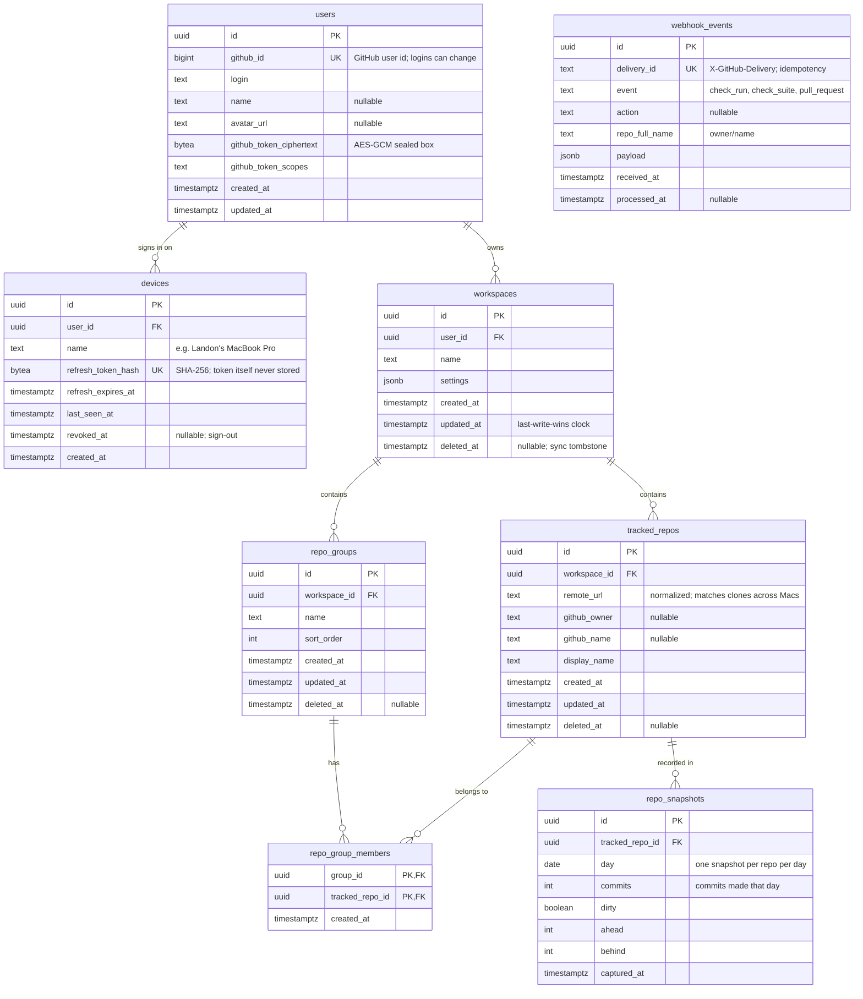

# Database design

The backend's PostgreSQL schema ([ADR 0005](../adr/0005-use-postgresql.md)). It's created only by Fluent migrations (#31). This document is the reviewed design they implement.

The macOS app keeps its own local state (scan folders, discovered repositories, groups) in SwiftData. The backend stores only what must leave the Mac:
- the user's GitHub identity and token
- signed-in devices
- groups to sync between Macs (#80)
- activity snapshots (#81)
- webhook deliveries (#77)

## Entity-relationship diagram

`webhook_events` has no foreign key. Deliveries are keyed by `owner/name` and fan out to every user tracking that repository, so they're joined by value (`tracked_repos.github_owner/github_name`), not by reference.

## Tables

### `users`
A person signed in with GitHub.

| Column | Type | Constraints | Notes |
| --- | --- | --- | --- |
| `id` | `uuid` | PK, default `gen_random_uuid()` | |
| `github_id` | `bigint` | NOT NULL, **UNIQUE** | Stable identity; `login` can be renamed |
| `login` | `text` | NOT NULL | Refreshed at each sign-in |
| `name`, `avatar_url` | `text` | NULL | Profile display |
| `github_token_ciphertext` | `bytea` | NOT NULL | GitHub OAuth token encrypted at rest with AES-GCM (key from `TOKEN_ENCRYPTION_KEY`, #49) |
| `github_token_scopes` | `text` | NOT NULL | Granted scopes, to detect missing permissions |
| `created_at`, `updated_at` | `timestamptz` | NOT NULL | |

### `devices`
One signed-in copy of the app. The app holds a short-lived JWT access token plus a refresh token; only the refresh token's hash is stored.

| Column | Type | Constraints | Notes |
| --- | --- | --- | --- |
| `id` | `uuid` | PK | Also the JWT `sid` claim |
| `user_id` | `uuid` | NOT NULL, FK → `users.id` **ON DELETE CASCADE** | |
| `name` | `text` | NOT NULL | Shown in account settings |
| `refresh_token_hash` | `bytea` | NOT NULL, **UNIQUE** | SHA-256 of a 256-bit random token; rotated on every refresh |
| `refresh_expires_at` | `timestamptz` | NOT NULL | |
| `last_seen_at`, `created_at` | `timestamptz` | NOT NULL | |
| `revoked_at` | `timestamptz` | NULL | Set on sign-out; revoked devices can't refresh |

Index: `(user_id)`.

### `workspaces`
A user's synced configuration. Each user has a default workspace; more are possible later.

| Column | Type | Constraints | Notes |
| --- | --- | --- | --- |
| `id` | `uuid` | PK | |
| `user_id` | `uuid` | NOT NULL, FK → `users.id` **ON DELETE CASCADE** | |
| `name` | `text` | NOT NULL | |
| `settings` | `jsonb` | NOT NULL, default `'{}'` | Synced preferences such as the stale branch threshold |
| `created_at`, `updated_at` | `timestamptz` | NOT NULL | |
| `deleted_at` | `timestamptz` | NULL | Tombstone |

Unique: `(user_id, name)`.

### `tracked_repos`
A repository the user tracks, identified by its **remote URL**, because local paths differ between Macs (#80).

| Column | Type | Constraints | Notes |
| --- | --- | --- | --- |
| `id` | `uuid` | PK | |
| `workspace_id` | `uuid` | NOT NULL, FK → `workspaces.id` **ON DELETE CASCADE** | |
| `remote_url` | `text` | NOT NULL | Normalized: lower-case host, no credentials, no `.git` |
| `github_owner`, `github_name` | `text` | NULL | Set when the remote is on github.com (`GitHubRepository`) |
| `display_name` | `text` | NOT NULL | |
| `created_at`, `updated_at` | `timestamptz` | NOT NULL | |
| `deleted_at` | `timestamptz` | NULL | Tombstone |

Unique: `(workspace_id, remote_url)`. Index: `(github_owner, github_name)` for webhook fan-out and badge lookups.

### `repo_groups` and `repo_group_members`
User-defined groups (such as "School" or "Work") in a many-to-many relationship with repositories, matching the app's `RepoGroup`.

| Column | Type | Constraints |
| --- | --- | --- |
| `repo_groups.id` | `uuid` | PK |
| `repo_groups.workspace_id` | `uuid` | NOT NULL, FK → `workspaces.id` **ON DELETE CASCADE** |
| `repo_groups.name` | `text` | NOT NULL; unique `(workspace_id, name)` |
| `repo_groups.sort_order` | `int` | NOT NULL, default 0 |
| `repo_groups.created_at`, `updated_at` | `timestamptz` | NOT NULL |
| `repo_groups.deleted_at` | `timestamptz` | NULL |
| `repo_group_members.group_id` | `uuid` | PK (part), FK → `repo_groups.id` **ON DELETE CASCADE** |
| `repo_group_members.tracked_repo_id` | `uuid` | PK (part), FK → `tracked_repos.id` **ON DELETE CASCADE** |
| `repo_group_members.created_at` | `timestamptz` | NOT NULL |

Index: `repo_group_members(tracked_repo_id)`. The composite primary key already covers lookups by `group_id`.

### `repo_snapshots`
Daily activity per repository, uploaded by the app for the history chart (#81).

| Column | Type | Constraints | Notes |
| --- | --- | --- | --- |
| `id` | `uuid` | PK | |
| `tracked_repo_id` | `uuid` | NOT NULL, FK → `tracked_repos.id` **ON DELETE CASCADE** | |
| `day` | `date` | NOT NULL | In the user's time zone, as reported by the app |
| `commits` | `int` | NOT NULL, CHECK `>= 0` | |
| `dirty` | `boolean` | NOT NULL | |
| `ahead`, `behind` | `int` | NOT NULL, CHECK `>= 0` | |
| `captured_at` | `timestamptz` | NOT NULL | |

Unique: `(tracked_repo_id, day)`. Re-uploading a day updates it (upsert). That unique index also serves the chart's range query (`WHERE tracked_repo_id = $1 AND day >= $2`).

### `webhook_events`
GitHub deliveries received at the webhook endpoint (#77). Kept for idempotency and debugging; pruned after 30 days.

| Column | Type | Constraints | Notes |
| --- | --- | --- | --- |
| `id` | `uuid` | PK | |
| `delivery_id` | `text` | NOT NULL, **UNIQUE** | `X-GitHub-Delivery`; a redelivery is ignored |
| `event` | `text` | NOT NULL | `X-GitHub-Event` |
| `action` | `text` | NULL | Payload `action` |
| `repo_full_name` | `text` | NOT NULL | `owner/name` |
| `payload` | `jsonb` | NOT NULL | Signature verified before insert (#49) |
| `received_at` | `timestamptz` | NOT NULL | |
| `processed_at` | `timestamptz` | NULL | Set after the cache was invalidated and clients notified |

Index: `(repo_full_name, received_at DESC)`.

## Cascade rules

| Deleting… | Also deletes | Why |
| --- | --- | --- |
| a user | devices, workspaces → repositories, groups, memberships, snapshots | Account deletion removes all personal data |
| a workspace | its repositories, groups, memberships, snapshots | Owned data |
| a group | its memberships, **not** the repositories | Matches the app: deleting a group keeps its repositories |
| a repository | its memberships and snapshots | |

Sync deletions are **soft** (`deleted_at`) so another Mac learns about them. Rows are hard-deleted after 90 days.

## Sync and conflicts

Sync (#80) is last-write-wins per row:
- Clients send `updated_at` with each change. The server keeps whichever row has the later timestamp.
- Deletions are rows with `deleted_at` set, so they win over older edits.
- Clients pull changes with `updated_at > last_sync`.

## Conventions

- **Keys:** `uuid` everywhere, generated server-side; nothing guessable in URLs.
- **Time:** `timestamptz`, stored in UTC.
- **Names:** `snake_case` tables (plural) and columns. Fluent models map to these explicitly.
- **Integrity:** every foreign key and uniqueness rule is a database constraint, not only app logic.
- **Secrets:** OAuth tokens are encrypted at rest and refresh tokens are stored only as hashes. Neither appears in logs or `webhook_events`.

## Environments

- `repohub_dev`: docker-compose or the DevContainer.
- `repohub_test`: reset for each test run.
- Production: on Fly.io.

Separating them is #32.

## Migrations

The schema is created and changed **only** by the Fluent migrations in `Backend/Sources/App/Migrations/` (#31). No environment is ever changed by hand.

- **Order:** one migration per table in dependency order, then `CreateIndexes`. They're listed in `Migrations.all`. Never reorder, edit, or remove a migration that has run anywhere; add a new one at the end.
- **Reversible:** every migration implements `revert`. CI proves the full schema can be created, torn down, and recreated on a clean database (`scripts/check-migrations.sh`, `make check-migrations`).
- **Running:** `make migrate` applies pending migrations to `$DATABASE_URL`. The DevContainer runs it when created, and continuous deployment runs it before the new version serves traffic (#43).
- **Tests:** integration tests migrate an empty schema before each test and revert it afterwards.
